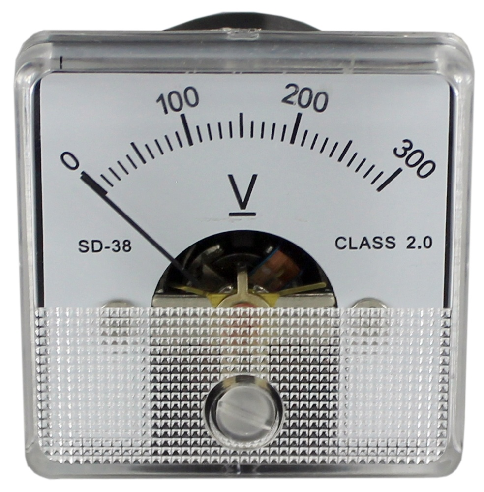
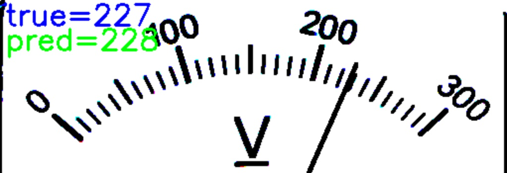

# A-G-I-demo

Analog Gauge Inspection

Задача распознавания показаний аналоговых стрелочных приборов в общем случае делится на два этапа:
1. найти прибор на картинке, очертить его bb или выделить сегментацией
(возможно сделать классификацию чтобы определить конкретный вид прибора).
2. определить положение стрелки на найденном приборе и прочитать показания.

Вот [тут](https://indatalabs.com/blog/ai-inspection) статья на эту тему.

Данный пример решает вторую часть задачи: научиться определять показания прибора по картинке.
В качестве датасета будем использовать синтетические данные. 
Возьмем изображение какого-нибудь стрелочного прибора и уберём с изображения стрелку.
Функция генерации данных для обучения будет помещать стрелку на рисунок в соответствии 
с заданным (сгенерированным) значением показания.

Как видно на изображении прибора, идея обучить нейронку различать положение стрелки не выглядит лёгкой.
Множество пикселей, составляющих стрелку, ничтожно мало по сравнению с общей площадью рисунка.
(я специально взял картинку прибора с тонкой стрелкой.)

Был реализован следующий алгоритм:
1. Генерируется выборка из 60 картинок с последовательно идущими показаниями прибора (дважды число делений шкалы).
2. Берется модель VGG16 с весами, но без последнего слоя (классификатора) - получается экстрактор фич.
3. Выборка картинок прогоняется через модель - получается массив фич размерности (60,4096).
4. Картинка, предикт которой надо получить, прогоняется через экстрактор фич.
5. Результат предикта сравнивается с массивом фич (косинусное расстояние), выбирается наиболее близкий вектор 
и соответствующий угол поворота стрелки (показание прибора).

Таким образом, удалось избежать обучения архитектуры как такового, если не считать подготовку массива фич, что занимает несколько секунд.

Точность при 60 картинках составила менее половины деления шкалы (4В при шкале 30 отсчетов и диапазоне 300В)

main.py - демонстрация алгоритма.

Model_VGG16_as_features_extractor.ipynb - ноутбук по задаче.
